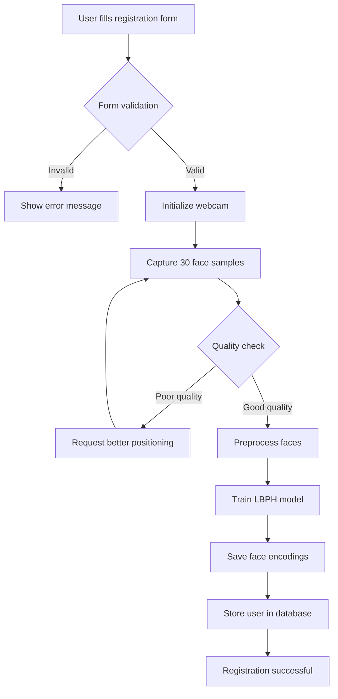

Here's a comprehensive README.md file for your Face Authentication System:

```markdown
# Face Authentication System

A secure biometric authentication system that uses facial recognition for user verification. Built with Flask, OpenCV, and SQLite, this system provides a web-based interface for user registration and identity verification through facial recognition.

## 📋 Table of Contents
- [Project Overview](#project-overview)
- [Features](#features)
- [Technology Stack](#technology-stack)
- [System Architecture](#system-architecture)
- [Authentication Process Flow](#authentication-process-flow)
- [Project Structure](#project-structure)
- [Installation Guide](#installation-guide)
- [Usage Guide](#usage-guide)
- [Security Features](#security-features)
- [Troubleshooting](#troubleshooting)
- [Future Improvements](#future-improvements)

## 🎯 Project Overview

The Face Authentication System is a biometric authentication solution that replaces traditional password-based authentication with facial recognition technology. It allows users to register their facial features and subsequently verify their identity using their webcam. The system is designed for local deployment on Windows hosts and uses a SQLite database to securely store user information.

### Goals
- Provide secure biometric authentication using facial recognition
- Eliminate the need for passwords or physical tokens
- Ensure only authorized users can access the system
- Maintain user privacy through secure data storage
- Offer a user-friendly web interface for registration and verification

## ✨ Features

### User Registration
- Create new user accounts with username, 4-digit ID, and role
- Capture multiple face samples (30 samples) from webcam
- Real-time face quality assessment (sharpness, lighting, positioning)
- Liveness detection (eye detection to prevent photo attacks)
- Automatic face preprocessing and model training
- Duplicate user ID prevention

### Identity Verification
- Multi-factor verification (credentials + facial recognition)
- Real-time face matching with confidence scoring
- Strict verification thresholds (requires 5 good matches)
- Visual feedback during verification (confidence bars, match indicators)
- Failed attempt tracking and logging
- Session-based verification

### Security Features
- User ID hashing (SHA-256) for database storage
- Liveness detection to prevent spoofing attacks
- Multiple verification frames to ensure consistency
- Configurable confidence thresholds
- Attempt tracking and logging

### User Interface
- Modern, responsive web design
- Real-time camera feed display
- Progress indicators for registration/verification
- Success/error modals with clear feedback
- Mobile-responsive layout
- Intuitive navigation

## 🛠 Technology Stack

| Component | Technology | Purpose |
|-----------|------------|---------|
| Backend | Flask (Python) | Web server and application logic |
| Face Recognition | OpenCV (cv2.face) | Face detection and LBPH recognition |
| Database | SQLite3 | User data storage |
| Frontend | HTML5, CSS3, JavaScript | User interface |
| Icons | Font Awesome 6 | Visual enhancements |
| Camera Access | OpenCV VideoCapture | Webcam integration |

## 🏗 System Architecture

```
┌─────────────────────────────────────────────────────────────┐
│                      Client Browser                          │
│  ┌─────────────┐  ┌─────────────┐  ┌─────────────────────┐  │
│  │  Home Page  │  │ Register    │  │ Verify Identity     │  │
│  └─────────────┘  └─────────────┘  └─────────────────────┘  │
└─────────────────────────┬───────────────────────────────────┘
                          │ HTTP/JSON
┌─────────────────────────▼───────────────────────────────────┐
│                    Flask Application                         │
│  ┌─────────────────────────────────────────────────────┐    │
│  │  Routes: /, /register, /verify, /users             │    │
│  └─────────────────────────────────────────────────────┘    │
│  ┌─────────────────┐  ┌──────────────────────────────────┐  │
│  │  Database       │  │  Face Recognition System         │  │
│  │  Module         │  │  - Face Detection                │  │
│  │  - User storage │  │  - LBPH Training                 │  │
│  │  - CRUD ops     │  │  - Face Verification             │  │
│  └─────────────────┘  └──────────────────────────────────┘  │
└─────────────────────────────────────────────────────────────┘
                          │
        ┌─────────────────┼─────────────────┐
        ▼                 ▼                 ▼
┌──────────────┐ ┌──────────────┐ ┌──────────────┐
│  SQLite DB   │ │ Face Models  │ │Face Encodings│
│  (face_auth) │ │  (.yml files)│ │  (images)    │
└──────────────┘ └──────────────┘ └──────────────┘
```

## 🔄 Authentication Process Flow

### Registration Flow



### Verification Flow

```graph TD
    A[User enters credentials] --> B{Check database}
    B -->|Not found| C[Show user not found]
    B -->|Found| D{Verify credentials}
    D -->|Mismatch| E[Invalid credentials]
    D -->|Match| F[Initialize webcam]
    F --> G[Capture live face]
    G --> H{Face detection}
    H -->|No face| I[Request face presence]
    I --> G
    H -->|Face found| J[Extract face features]
    J --> K[Compare with stored model]
    K --> L{Confidence < threshold?}
    L -->|No| M[Failed attempt +1]
    M --> N{Max attempts?}
    N -->|No| G
    N -->|Yes| O[Verification failed]
    L -->|Yes| P[Successful match +1]
    P --> Q{Enough matches?}
    Q -->|No| G
    Q -->|Yes| R[Verification successful]
```

### Matching Criteria

The system uses multiple criteria for successful verification:
1. **Confidence Score**: < 60 (0 = perfect match)
2. **Required Matches**: 5 successful frames
3. **Face Quality**: Sharpness > 40
4. **Liveness**: Eyes detected in frame
5. **Consistency**: Multiple consecutive matches

## 📁 Project Structure

```
face_auth_system/
│
├── app.py                      # Main Flask application
├── database.py                 # Database operations and user management
├── face_utils.py              # Face recognition core logic
│
├── templates/                  # HTML templates
│   ├── index.html             # Home page
│   ├── register.html          # User registration page
│   └── verify.html            # Identity verification page
│
├── static/                     # Static assets
│   └── css/
│       └── style.css          # Styling and animations
│
├── face_models/                # Trained face models (.yml files)
│   ├── user_1234.yml          # User-specific models
│   └── label_map.json         # User ID to label mapping
│
├── face_encodings/             # Reference face images
│   └── [user_id]/             # User-specific folders
│       ├── face_0.jpg         # Captured face samples
│       ├── face_1.jpg
│       └── metadata.json      # Registration metadata
│
├── face_auth.db                # SQLite database file
└── README.md                   # This file
```

### Core Files Description

#### `app.py`
- Main application entry point
- Defines Flask routes for web interface
- Handles HTTP requests and responses
- Manages session state
- Orchestrates registration and verification flows

#### `database.py`
- SQLite database operations
- User CRUD operations
- Password hashing (SHA-256)
- Verification attempt tracking
- Timestamp management

#### `face_utils.py`
- Face detection using Haar cascades
- LBPH face recognizer implementation
- Face preprocessing and normalization
- Quality assessment algorithms
- Liveness detection (eye detection)
- Model training and loading

#### `face_models/`
- Stores trained LBPH models for each user
- `user_{id}.yml`: Binary model file
- `label_map.json`: User ID to numeric label mapping

#### `face_encodings/`
- Stores reference face images for each user
- Used for additional verification checks
- Contains registration metadata

## 📥 Installation Guide

### Prerequisites
- Windows 10/11
- Python 3.8 or higher
- Webcam
- Administrative privileges (for camera access)

### Step 1: Clone or Create Project
```bash
mkdir face_auth_system
cd face_auth_system
```

### Step 2: Create Virtual Environment
```bash
python -m venv venv
venv\Scripts\activate  # On Windows
```

### Step 3: Install Dependencies
```bash
# Install OpenCV with contrib modules (required for face recognition)
pip install opencv-contrib-python

# Install Flask web framework
pip install flask

# Install numpy for numerical operations
pip install numpy
```

### Step 4: Create Project Files
Create all the files as described in the project structure above.

### Step 5: Run the Application
```bash
python app.py
```

### Step 6: Access the Application
Open your browser and navigate to:
```
http://localhost:5000
```

## 🚀 Usage Guide

### Registering a New User

1. **Navigate to Registration**: Click "Register New User" on the home page
2. **Enter Information**:
   - Username: Any name
   - 4-digit User ID: Must be exactly 4 digits
   - Role: Select from dropdown (Admin, User, Manager, Guest)
3. **Start Face Capture**: Click "Start Face Registration"
4. **Position Yourself**:
   - Look directly at the camera
   - Ensure good lighting
   - Remove glasses if possible
   - Keep face centered
5. **Capture Process**: The system will capture 30 face samples
6. **Registration Complete**: Success message will appear

### Verifying Identity

1. **Navigate to Verification**: Click "Verify Identity" on the home page
2. **Enter Credentials**:
   - Username: Your registered username
   - 4-digit User ID: Your registered ID
   - Role: Your selected role
3. **Start Verification**: Click "Start Face Verification"
4. **Look at Camera**:
   - Hold still for 5 seconds
   - Maintain good lighting
   - Look directly at the camera
5. **Verification Result**:
   - Success: Green message with "Verification Successful"
   - Failure: Red message with reason for failure

### Understanding Verification Feedback

| Feedback | Meaning | Action Required |
|----------|---------|-----------------|
| "GOOD MATCH (XX%)" | Face matches with good confidence | Continue holding still |
| "WRONG PERSON DETECTED" | Face doesn't match registered user | Verify using correct user |
| "WEAK MATCH (XX%)" | Low confidence match | Improve lighting, remove obstructions |
| "Face too blurry" | Camera focus issue | Hold still, adjust lighting |
| "Eyes not detected" | Face not clearly visible | Remove glasses, face camera directly |

## 🔒 Security Features

### Data Protection
- **User ID Hashing**: All user IDs are SHA-256 hashed before database storage
- **No Plain Text Storage**: Only hashed IDs are stored in the database
- **Separate Storage**: Face models and images stored separately from credentials

### Anti-Spoofing Measures
- **Liveness Detection**: Requires eye detection to prevent photo attacks
- **Multiple Samples**: Requires multiple consecutive matches
- **Quality Checks**: Rejects blurry or poorly lit faces
- **Consistency Checks**: Verifies face consistency across frames

### Access Control
- **Role-Based**: Different roles (Admin, User, Manager, Guest)
- **Failed Attempt Tracking**: Logs unsuccessful verification attempts
- **Session Management**: No persistent sessions for security

## 🔧 Troubleshooting

### Common Issues and Solutions

| Issue | Cause | Solution |
|-------|-------|----------|
| "Could not open webcam" | Camera not detected or in use | Check camera connection, close other camera apps |
| "Module 'cv2.face' has no attribute" | Missing contrib module | Run: `pip install opencv-contrib-python` |
| "No faces captured" | Poor lighting or positioning | Ensure good lighting, center face, remove glasses |
| "User not found" | Wrong ID entered | Verify 4-digit ID matches registration |
| "Verification always fails" | Poor registration quality | Re-register with better lighting and positioning |
| "High memory usage" | Too many face samples | Reduce num_samples in capture_face() |

### Debug Mode
To enable debug logging:
```python
# In app.py, ensure debug=True
app.run(debug=True, host='localhost', port=5000)
```

### Database Reset
To reset the database:
```bash
# Delete existing database
del face_auth.db

# Delete face models
rmdir /s face_models

# Delete face encodings
rmdir /s face_encodings

# Restart application
python app.py
```

## 📈 Future Improvements

### Planned Features
- [ ] **Multi-factor Authentication**: Combine face recognition with PIN or OTP
- [ ] **Deep Learning Models**: Replace LBPH with CNN-based face recognition
- [ ] **Cloud Sync**: Support for multi-device synchronization
- [ ] **Mobile App**: Native mobile application for on-the-go authentication
- [ ] **Face Mask Detection**: Support for masked face recognition
- [ ] **Age and Gender Detection**: Additional biometric features
- [ ] **Audit Logs**: Detailed authentication history
- [ ] **Email Notifications**: Alert users of unauthorized attempts
- [ ] **API Endpoints**: RESTful API for third-party integration
- [ ] **Docker Support**: Containerized deployment

### Performance Optimizations
- [ ] GPU acceleration for face detection
- [ ] Caching mechanisms for faster verification
- [ ] Database indexing for quicker lookups
- [ ] Asynchronous processing for better UI responsiveness

## 📝 License

This project is for educational and personal use. Please ensure compliance with local privacy laws and regulations when implementing biometric authentication systems.

## 🤝 Contributing

Feel free to fork this project and submit pull requests for improvements. Please ensure:
- Code follows PEP 8 standards
- New features include proper error handling
- Documentation is updated accordingly

## 📧 Support

For issues and questions:
1. Check the troubleshooting section above
2. Enable debug mode to see detailed error messages
3. Review console output for specific error details

---

**Note**: This system is designed for local deployment on Windows hosts. For production use, additional security measures such as HTTPS, proper secret key management, and database encryption should be implemented.

**Warning**: Biometric authentication systems should be used responsibly. Ensure you have proper consent from users before collecting and storing facial data.
```

This README provides comprehensive documentation covering:
- Project goals and features
- Technology stack and architecture
- Detailed authentication flow diagrams
- File structure and descriptions
- Step-by-step installation and usage
- Security features and troubleshooting
- Future improvement plans

The documentation is designed to be accessible to both technical and non-technical users, with clear explanations and visual aids.
